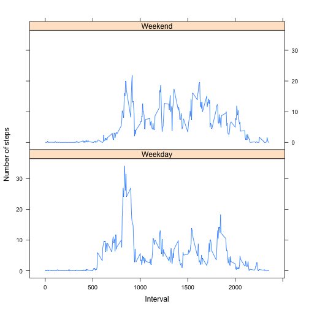

# Reproducible Research: Peer Assessment 1


## Loading and preprocessing the data


```r
# Set working directory
setwd("/Users/emelaktas/RepData_PeerAssessment1")
```


```r
# From assignment instructions: Load the data (i.e. read.csv())

# Load the data using read.table()
data <- read.table(file = "activity.csv", sep = ",", header = T)

# Summary of data
summary(data)
```

```
##      steps               date          interval   
##  Min.   :  0.0   2012-10-01:  288   Min.   :   0  
##  1st Qu.:  0.0   2012-10-02:  288   1st Qu.: 589  
##  Median :  0.0   2012-10-03:  288   Median :1178  
##  Mean   : 37.4   2012-10-04:  288   Mean   :1178  
##  3rd Qu.: 12.0   2012-10-05:  288   3rd Qu.:1766  
##  Max.   :806.0   2012-10-06:  288   Max.   :2355  
##  NA's   :2304    (Other)   :15840
```

```r

# Check the sstructure of variables
str(data)
```

```
## 'data.frame':	17568 obs. of  3 variables:
##  $ steps   : int  NA NA NA NA NA NA NA NA NA NA ...
##  $ date    : Factor w/ 61 levels "2012-10-01","2012-10-02",..: 1 1 1 1 1 1 1 1 1 1 ...
##  $ interval: int  0 5 10 15 20 25 30 35 40 45 ...
```

```r

# From assignment instructions: Process/transform the data (if necessary)
# into a format suitable for your analysis

# Convert date to date (it is read as a factor) datev: date variable, not to
# override the original date.
data$datev <- as.Date(data$date, format = "%Y-%m-%d")

# Check the sstructure of variables again and see datev is date
str(data)
```

```
## 'data.frame':	17568 obs. of  4 variables:
##  $ steps   : int  NA NA NA NA NA NA NA NA NA NA ...
##  $ date    : Factor w/ 61 levels "2012-10-01","2012-10-02",..: 1 1 1 1 1 1 1 1 1 1 ...
##  $ interval: int  0 5 10 15 20 25 30 35 40 45 ...
##  $ datev   : Date, format: "2012-10-01" "2012-10-01" ...
```

```r

# Summary of data
summary(data)
```

```
##      steps               date          interval        datev           
##  Min.   :  0.0   2012-10-01:  288   Min.   :   0   Min.   :2012-10-01  
##  1st Qu.:  0.0   2012-10-02:  288   1st Qu.: 589   1st Qu.:2012-10-16  
##  Median :  0.0   2012-10-03:  288   Median :1178   Median :2012-10-31  
##  Mean   : 37.4   2012-10-04:  288   Mean   :1178   Mean   :2012-10-31  
##  3rd Qu.: 12.0   2012-10-05:  288   3rd Qu.:1766   3rd Qu.:2012-11-15  
##  Max.   :806.0   2012-10-06:  288   Max.   :2355   Max.   :2012-11-30  
##  NA's   :2304    (Other)   :15840
```


## What is mean total number of steps taken per day?

For this part of the assignment, you can ignore the missing values in the dataset.


```r

# Since we can ignore missing values, let us work with complete cases in the
# data set.
datacomplete <- data[complete.cases(data), ]

# Create the sum of steps for each day. First argument in tapply() is the
# variable sum of which is to be calculated. Second argument in tapply() is
# the date variable, since we sum the steps for each day. Third argument in
# tapply() is the function we want to apply on the first variable.
totalsteps <- tapply(datacomplete$steps, datacomplete$datev, sum)

# From assignment instructions: Make a histogram of the total number of
# steps taken each day
hist(totalsteps, main = "Histogram of Total Number of Steps", xlab = "")
```

 

```r

# From assignment instructions: Calculate and report the mean and median
# total number of steps taken per day

# Calculate mean
meansteps <- mean(totalsteps)
meansteps
```

```
## [1] 10766
```

```r

# Calculate median
mediansteps <- median(totalsteps)
mediansteps
```

```
## [1] 10765
```


The mean value of the total number of steps per day is 10766. The median of total number of steps taken per day is 10765.

## What is the average daily activity pattern?


```r
# Make a time series plot (i.e. type = 'l') of the 5-minute interval
# (x-axis) and the average number of steps taken, averaged across all days
# (y-axis)

# Use tapply to calculate average number of steps in the interval averaged
# across all days
averagesteps <- tapply(datacomplete$steps, datacomplete$interval, mean)

# Plot time series: x = interval, y = average number of steps
plot(names(averagesteps), averagesteps, type = "l", xlab = "", main = "Average number of steps per 5-minute interval", 
    ylab = "Average steps")
```

 

```r

# Which 5-minute interval, on average across all the days in the dataset,
# contains the maximum number of steps?
interval.max <- averagesteps[which(averagesteps == max(averagesteps))]
interval.max
```

```
##   835 
## 206.2
```

```r

# Lower limit of the interval
interval.lower <- names(averagesteps)[which(averagesteps == max(averagesteps)) - 
    1]
interval.lower
```

```
## [1] "830"
```

```r

# Upper limit of the interval
interval.upper <- names(averagesteps)[which(averagesteps == max(averagesteps))]
interval.upper
```

```
## [1] "835"
```


The interval 830 - 835 contains the maximum number of steps on average across all the days in the dataset. The maximum of average number of steps is 206.1698.


## Imputing missing values


```r
# From assignment instructions: Calculate and report the total number of
# missing values in the dataset (i.e. the total number of rows with NAs)
total.missing <- sum(is.na(data$steps))
total.missing
```

```
## [1] 2304
```

```r

# From assignment instructions: Devise a strategy for filling in all of the
# missing values in the dataset. The strategy does not need to be
# sophisticated. For example, you could use the mean/median for that day, or
# the mean for that 5-minute interval, etc.

# Replacing with the mean for the same interval may make more sense for week
# days.  Create a variable that shows the day of the week
data$day <- weekdays(data$datev)

# Update datacomplete
datacomplete <- data[complete.cases(data), ]

# Use reshape to melt data
require(reshape)
```

```
## Loading required package: reshape
## Loading required package: plyr
## 
## Attaching package: 'reshape'
## 
## The following objects are masked from 'package:plyr':
## 
##     rename, round_any
```

```r

# Melt data
data.molten <- melt.data.frame(datacomplete, id.vars = c("datev", "interval", 
    "day"), measure.vars = "steps", variable_name = "steps")

# Cast data, calculates mean of steps for each interval * day combination
imputed.mean <- cast(data.molten, interval + day ~ steps, mean)

# Create a new dataset that is equal to the original dataset but with the
# missing data filled in.
data.imputed <- data.frame(steps = numeric(dim(data)[1]), interval = data$interval, 
    date = data$datev, day = data$day)

# Replace NAs with calculated mean of interval by day
for (i in 1:dim(data)[1]) {
    if (is.na(data$steps[i])) {
        data.imputed$steps[i] <- imputed.mean$steps[which(imputed.mean$interval == 
            data$interval[i] & imputed.mean$day == data$day[i])]
    }
}

# From assignment instructions: Make a histogram of the total number of
# steps taken each day and Calculate and report the mean and median total
# number of steps taken per day. Do these values differ from the estimates
# from the first part of the assignment? What is the impact of imputing
# missing data on the estimates of the total daily number of steps?

# Total number of steps with NAs replaced with mean steps for the day and
# interval
totalsteps.imputed <- tapply(data.imputed$steps, data.imputed$date, sum)

# Histogram of total number of steps
hist(totalsteps.imputed, main = "Histogram of Total Number of Steps NAs imputed", 
    xlab = "")
```

 

```r

# Mean total number of steps
meansteps.imputed <- mean(totalsteps.imputed)
meansteps
```

```
## [1] 10766
```

```r
meansteps.imputed
```

```
## [1] 1467
```

```r

if (meansteps == meansteps.imputed) {
    print("Mean of total steps with NAs imputed is equal to the mean of total steps calculated with NAs removed.")
} else {
    print("Mean of total steps has changed after imputing mean steps for the day and interval for NAs.")
}
```

```
## [1] "Mean of total steps has changed after imputing mean steps for the day and interval for NAs."
```

```r

mediansteps.imputed <- median(totalsteps.imputed)
mediansteps
```

```
## [1] 10765
```

```r
mediansteps.imputed
```

```
## [1] 0
```

```r

if (mediansteps == mediansteps.imputed) {
    print("Median of total steps with NAs imputed is equal to the mean of total steps calculated with NAs removed.")
} else {
    print("Median of total steps has changed after imputing mean steps for the day and interval for NAs.")
}
```

```
## [1] "Median of total steps has changed after imputing mean steps for the day and interval for NAs."
```


The total number of missing values in the dataset is 2304. When NAs are imputed with mean of the corresponding day and interval, they decrease the mean of observed variables because the number of NAs are large:  13.11 per cent of the data is missing.

## Are there differences in activity patterns between weekdays and weekends?


```r

# From assignment instructions: Create a new factor variable in the dataset
# with two levels – “weekday” and “weekend” indicating whether a given date
# is a weekday or weekend day.

# Find the day of the observation and assign weekday variable 1 if weekday,
# 2 if weekend.
for (i in 1:dim(data.imputed)[1]) {
    if (is.element(data.imputed$day[i], c("Saturday", "Sunday"))) {
        data.imputed$weekday[i] <- 2  # weekend
    } else {
        data.imputed$weekday[i] <- 1  # weekday
    }
}

# Factor weekday variable
data.imputed$weekday <- factor(data.imputed$weekday, labels = c("Weekday", "Weekend"))


# Make a panel plot containing a time series plot (i.e. type = 'l') of the
# 5-minute interval (x-axis) and the average number of steps taken, averaged
# across all weekday days or weekend days (y-axis). The plot should look
# something like the following, which was creating using simulated data:

require(lattice)
```

```
## Loading required package: lattice
```

```r

# Melt data with NAs calculated.
data.imputed.molten <- melt.data.frame(data.imputed, id.vars = c("date", "interval", 
    "day", "weekday"), measure.vars = "steps", variable_name = "steps")

# Cast data to find average number of steps taken, averaged across all
# weekday days or weekend days
data.imputed.mean <- cast(data.imputed.molten, interval + weekday ~ steps, mean)

# Plot average number of steps across intervals
xyplot(data.imputed.mean$steps ~ data.imputed.mean$interval | data.imputed.mean$weekday, 
    ylab = "Number of steps", xlab = "Interval", type = "l", layout = c(1, 2))
```

 


